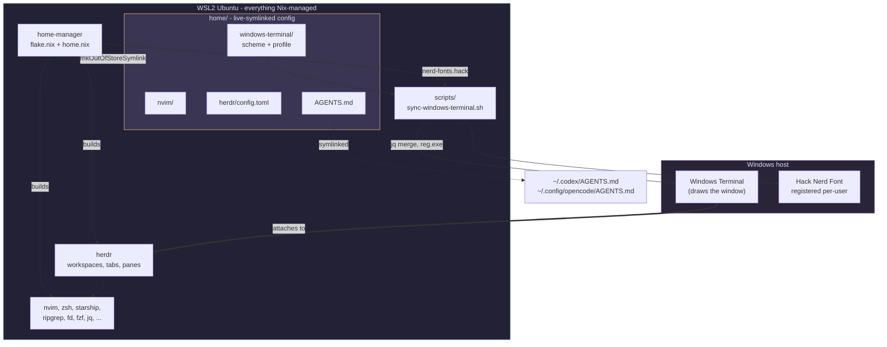

# dotfiles-wsl

A WSL2 Ubuntu port of the "freshly installed Mac to a full agentic engineering
setup" configuration from [this video](https://www.youtube.com/watch?v=5N-okeDdIuI)
([original macOS repo](https://github.com/kunchenguid/dotfiles)).

The video builds its setup on **nix-darwin**, which only exists for macOS. This
repo rebuilds the same environment on WSL2 Ubuntu using **standalone
home-manager**, and keeps the video's actual promise intact: one command,
`./rebuild.sh`, reproduces the whole thing.

You get what the video produces: Nix-managed packages, zsh with autosuggestions
and syntax highlighting, Starship, a rose-pine terminal in Hack Nerd Font, a
modular Neovim config, the herdr agent multiplexer, and one global `AGENTS.md`
shared by every coding agent.

---

## Contents

- [Design](#design)
- [How this differs from the video](#how-this-differs-from-the-video)
- [Prerequisites](#prerequisites)
- [Install](#install)
- [Daily use](#daily-use)
- [Customizing](#customizing)
- [Repo layout](#repo-layout)
- [What is and is not reproducible](#what-is-and-is-not-reproducible)
- [Docs](#docs)

## Design

Two ideas carry the whole port.

**Everything that can live in WSL, does.** Packages, shell, editor, multiplexer
and agent config are all Nix-managed and pinned by `flake.lock`. Wipe the
distro, clone, run `./bootstrap.sh`, and you are back exactly where you were.

**The terminal is not the point.** The video spends a chapter configuring
WezTerm, but on WSL the terminal emulator is a Windows process that Nix cannot
manage. It is also mostly redundant here: **herdr** provides the workspaces,
tabs, panes and detachable sessions, so the host terminal only has to be a fast,
correct VT renderer with a good font. So this port drops WezTerm and uses
Windows Terminal, themed from two small JSON files in this repo and pushed
across the boundary by WSL itself. No PowerShell step, no admin rights.



Config under `home/` is linked with `mkOutOfStoreSymlink`, so editing a file in
this repo takes effect immediately with no rebuild. You only rebuild when you
change which packages Nix manages.

## How this differs from the video

| Video (macOS) | Here (WSL Ubuntu) | Why |
| --- | --- | --- |
| `nix-darwin` | standalone `home-manager` | WSL Ubuntu is not NixOS, so there is no system-level Nix module. home-manager owns `$HOME` only. |
| `sudo darwin-rebuild switch` | `home-manager switch` (no sudo) | Nothing outside `$HOME` is touched. |
| `nix-homebrew` + `brews`/`casks` | `home.packages` from nixpkgs | No Homebrew on Linux, and no need for it. |
| WezTerm, configured in Lua | Windows Terminal, themed from JSON | The terminal is a Windows process. herdr already provides tabs and panes, so its config surface is redundant. |
| `macos_window_background_blur` | `useAcrylic` + `opacity` | Same frosted look, different platform. |
| `system.defaults` (dock, Finder) | dropped | Desktop appearance, not dev environment, and not reproducible on Windows. Overclaiming to ship it. |
| `nerd-fonts.hack` via Nix is enough | Nix font, copied to Windows | The Windows font renderer cannot see Linux fontconfig. Still one pinned source. |
| `clipboard = 'unnamedplus'` just works | bridged via `clip.exe` / `powershell.exe` | A WSL VM has no selection wired to the Windows clipboard. |
| `herdr` from Homebrew | pinned upstream binary in `modules/herdr.nix` | Not in nixpkgs; pinned by hash rather than `curl \| sh`. |
| zsh is already the login shell | `bootstrap.sh` runs `chsh` | Ubuntu logs you into bash. |

Full reasoning: [`docs/00-what-changed-from-macos.md`](docs/00-what-changed-from-macos.md).

## Prerequisites

- Windows 10 22H2 or Windows 11, with **Windows Terminal** (preinstalled on Win11)
- WSL2 with Ubuntu (`wsl --install -d Ubuntu`)
- `git` inside WSL (`sudo apt install -y git` - the only apt package you need)

Check you are on WSL**2**; WSL1 cannot run the Nix daemon:

```powershell
wsl -l -v      # VERSION column must say 2
```

## Install

```bash
git clone https://github.com/<you>/dotfiles-wsl.git ~/dotfiles-wsl
cd ~/dotfiles-wsl
./bootstrap.sh
```

That is the whole install. There is no second step on the Windows side.

| Step | What it does |
| --- | --- |
| 0 | Confirms you are in WSL |
| 1 | Ensures systemd is enabled, since the Nix daemon needs it |
| 2 | Installs [Determinate Nix](https://install.determinate.systems/) |
| 3 | Symlinks the repo to `~/.dotfiles`, the stable path configs refer to |
| 4 | Offers to rewrite the `user = ` line in `flake.nix` to your username |
| 5 | Runs the first `home-manager switch` (retries on transient WSL DNS) |
| 6 | Makes the Nix zsh your login shell |
| 7 | Installs the font on Windows and themes Windows Terminal |

> If step 1 tells you to run `wsl --shutdown`, do that from **PowerShell**,
> reopen Ubuntu, and re-run `./bootstrap.sh`. Enabling systemd needs a restart.

The first build downloads a lot. That is normal and happens once.

Then open Windows Terminal: the Ubuntu profile is now the default, themed
rose-pine, in Hack Nerd Font. If glyphs look wrong, sign out of Windows and back
in once so it picks up the newly registered font.

## Daily use

```bash
./rebuild.sh       # apply any change: packages, shell, editor, terminal theme
```

Editing anything under `home/` (Neovim, herdr, `AGENTS.md`) needs **no rebuild**
- those are live symlinks. Rebuild when you change packages, or the terminal
theme, which is pushed to Windows at the end of every rebuild.

Start the multiplexer with `herdr`. Keybindings mirror tmux: `ctrl+b` prefix,
`prefix+c` new tab, `prefix+%` and `prefix+"` to split.

## Customizing

**Add a CLI tool.** Find it on [search.nixos.org](https://search.nixos.org/packages),
add it to `home.packages` in `home.nix`, run `./rebuild.sh`.

**Add a shell alias.** `programs.zsh.shellAliases` in `home.nix`, then rebuild.

**Change the terminal font size or colours.** Edit
`home/windows-terminal/profile.json` or `rose-pine-moon.json`, then
`./rebuild.sh` (or just `./scripts/sync-windows-terminal.sh`).

**Add a Neovim plugin.** Drop a file in `home/.config/nvim/lua/plugins/`.
lazy.nvim loads every file in that directory. No rebuild.

**Change agent behavior.** Edit `home/AGENTS.md`. It is symlinked into Claude
Code, Codex and opencode at once. No rebuild.

**Use a different terminal.** Nothing depends on Windows Terminal. Install what
you like; you need only Hack Nerd Font and truecolor. For a fully Nix-managed
terminal, add `wezterm` or `kitty` to `home.packages` and run it under WSLg -
100% reproducible, at the cost of WSLg latency and DPI quirks.
See [docs/05-terminal.md](docs/05-terminal.md).

## Repo layout

```
dotfiles-wsl/
├── flake.nix                       # inputs, pinning, the one `user =` line
├── home.nix                        # packages, zsh, starship, symlinks
├── modules/herdr.nix               # herdr from a hash-pinned upstream binary
├── bootstrap.sh                    # one-time setup, end to end
├── rebuild.sh                      # the everyday command
├── scripts/
│   └── sync-windows-terminal.sh    # the only thing that crosses to Windows
├── home/                           # live-symlinked into $HOME
│   ├── AGENTS.md                   # global agent memory, shared by all agents
│   ├── windows-terminal/           # colour scheme + profile, pushed to Windows
│   └── .config/
│       ├── herdr/config.toml
│       └── nvim/
│           ├── init.lua
│           └── lua/
│               ├── vim_config.lua  # options + the WSL clipboard bridge
│               ├── plugin.lua      # lazy.nvim bootstrap
│               ├── keys.lua
│               └── plugins/        # one file per concern
└── docs/                           # line-by-line explanation of every file
```

## What is and is not reproducible

Worth being precise about, since reproducibility is the video's whole premise.

**Fully reproducible**, declared in Nix and pinned by `flake.lock`: every CLI
package, Neovim, zsh and its plugins, Starship, herdr, the Hack Nerd Font
files, and every symlink into `$HOME`.

**Generated from this repo, re-applied every rebuild**: the Windows Terminal
colour scheme and profile, and the font's presence on the Windows side. Driven
from committed files, so there is one source of truth - but `settings.json` is a
file Windows also writes, and nothing reverts a change you make by hand in the
Settings UI. The sync reasserts our keys and leaves everything else alone.

**Not managed at all**: Windows Terminal itself (ships with Windows) and Windows
desktop settings. An earlier version of this repo shipped a `settings.ps1` of
registry writes; it was removed as overclaiming.

**Deliberately not pinned**: Neovim plugins, managed by lazy.nvim exactly as in
the video. Commit `home/.config/nvim/lazy-lock.json` if you want them locked.

## Docs

| Doc | Covers |
| --- | --- |
| [00 - What changed from macOS](docs/00-what-changed-from-macos.md) | Every deviation from the video and why |
| [01 - flake.nix](docs/01-flake-nix.md) | Inputs, pinning, `homeConfigurations` |
| [02 - home.nix](docs/02-home-nix.md) | Packages, zsh, Starship, `mkOutOfStoreSymlink` |
| [03 - modules/herdr.nix](docs/03-modules-herdr-nix.md) | Packaging a pinned binary in Nix |
| [04 - bootstrap.sh / rebuild.sh](docs/04-bootstrap-and-rebuild.md) | Both scripts, step by step |
| [05 - The terminal](docs/05-terminal.md) | Why WezTerm was dropped; the Windows Terminal setup |
| [06 - Neovim](docs/06-neovim.md) | Every Lua file, including the clipboard bridge |
| [07 - herdr](docs/07-herdr.md) | Keybindings and running agents in panes |
| [08 - Agents](docs/08-agents.md) | `AGENTS.md` fan-out, and what this repo refuses to manage |
| [09 - The Windows bridge](docs/09-windows-bridge.md) | `sync-windows-terminal.sh`, line by line |
| [10 - Troubleshooting](docs/10-troubleshooting.md) | WSL-specific failure modes |

## Credit

Original macOS configuration and the video explaining it:
[kunchenguid/dotfiles](https://github.com/kunchenguid/dotfiles).
This repo is an unaffiliated port.

## License

MIT-0.
