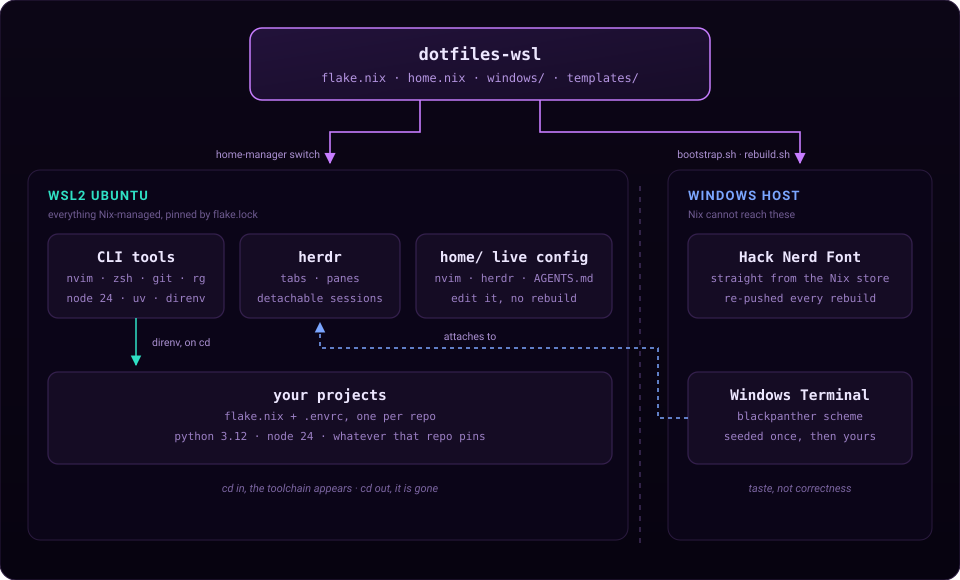

# dotfiles-wsl

My whole WSL2 Ubuntu setup, written down in files. One command puts it on a new
computer.

Get a new Windows laptop, clone this repo, run `./bootstrap.sh`, and you get the
same packages, the same shell, the same editor and the same terminal colours you
had before.

## What you get

- Packages installed by Nix, so everyone gets the same versions
- zsh, with command suggestions and colours
- The Starship prompt
- Neovim, set up and ready, with language servers so go-to-definition works
- herdr, a tool for running many terminals in one window
- One `AGENTS.md` file that every AI coding tool reads
- Hack Nerd Font, installed on the Windows side
- Your terminal colours, set up on the first install

## Contents

- [How it works](#how-it-works)
- [Before you start](#before-you-start)
- [Install](#install)
- [Everyday use](#everyday-use)
- [Neovim](#neovim)
- [herdr](#herdr)
- [Tools for one project](#tools-for-one-project)
- [Making changes](#making-changes)
- [What is in this repo](#what-is-in-this-repo)
- [What this repo can and cannot rebuild](#what-this-repo-can-and-cannot-rebuild)
- [Reference](#reference)

## How it works

Three ideas explain the whole repo.

**Anything that can live in WSL, lives in WSL.** Packages, shell, editor and
settings are all managed by Nix. The file `flake.lock` writes down the exact
version of everything. Delete your Linux install, clone this repo, run
`./bootstrap.sh`, and you are back where you were.

**Your home folder is shared, your projects are not.** This repo installs the
tools you want on *every* computer. But one project may need Python 3.12 and
another may need Python 3.10. Those go in the project itself, not here. See
[Tools for one project](#tools-for-one-project).

**The terminal is a Windows program, so we set it up once and then leave it
alone.** Windows Terminal draws your window. Nix runs inside Linux and cannot
reach it. Two things cross over when you install: the font, and the colours.
After that the terminal is yours to change.

<p align="center">
  
</p>

Files under `home/` are linked, not copied. So when you edit one, the change
works right away. You only need to rebuild when you add or remove a package.

## Before you start

You need:

- Windows 10 22H2 or Windows 11, with **Windows Terminal** (already installed on
  Windows 11)
- WSL2 with Ubuntu. Install it with `wsl --install -d Ubuntu`
- `git` inside WSL: `sudo apt install -y git`. This is the only thing you install
  with apt.

Check that you have WSL**2**, not WSL1. WSL1 cannot run Nix:

```powershell
wsl -l -v      # the VERSION column must say 2
```

## Install

```bash
git clone https://github.com/<you>/dotfiles-wsl.git ~/dotfiles-wsl
cd ~/dotfiles-wsl
./bootstrap.sh
```

That is the whole install. You do not need to run anything on the Windows side.

| Step | What it does |
| --- | --- |
| 0 | Checks that you are in WSL |
| 1 | Turns on systemd, which Nix needs |
| 2 | Installs [Determinate Nix](https://install.determinate.systems/) |
| 3 | Links the repo to `~/.dotfiles` |
| 4 | Offers to change the `user = ` line in `flake.nix` to your username |
| 5 | Builds and installs everything for the first time |
| 6 | Makes zsh your login shell |
| 7 | Installs Hack Nerd Font on Windows |
| 8 | Sets your terminal colours, one time only |

> If step 1 asks you to run `wsl --shutdown`, do it from **PowerShell**. Then
> open Ubuntu again and run `./bootstrap.sh` again. Turning on systemd needs a
> restart.

**Already like your terminal?** Step 8 replaces your colours, font, opacity and
background **once**. Your own colour schemes are kept, so you can switch straight
back in Windows Terminal's Settings screen, and the old `settings.json` is backed
up next to itself. To skip it entirely and keep the font only:

```bash
DOTFILES_SKIP_THEME=1 ./bootstrap.sh
```

The first build downloads a lot of files. This is normal and happens only once.

When it finishes, close and reopen Windows Terminal. If you see boxes instead of
icons, sign out of Windows and back in. Windows needs this to notice a new font.

## Everyday use

```bash
./rebuild.sh       # apply any change to packages, shell or editor
```

**The rule to remember:** files under `home/` are symlinked, so editing one
takes effect immediately. Everything else is built by Nix and needs a rebuild.

| You changed | Rebuild? |
| --- | --- |
| `home.nix`, `flake.nix` | yes, then open a new shell |
| Neovim, herdr, `AGENTS.md` (under `home/`) | no |
| Windows Terminal settings | no, it is a Windows program |

After a rebuild, open a new shell. Aliases and `$EDITOR` are set when a shell
starts, so one you already had open will not see them.

`rebuild.sh` never touches your terminal colours. See
[the reference](docs/README.md#the-terminal) to learn why.

Check nothing has drifted away from what the repo declares:

```bash
./scripts/check-drift.sh
```

## Neovim

Run `nvim`. The leader key is **space**. Press it and wait: which-key pops up a
list of what is available, so you do not have to memorise this table.

| Key | Does |
| --- | --- |
| `space` `f` | Find files by name |
| `space` `s` | Search text across the project |
| `space` `b` | Switch between open buffers |
| `space` `e` | File browser, edit the folder like a document |
| `space` `g` | Git interface (stage, commit, branch, diff) |
| `gd` | Go to definition |
| `Esc` | **Save.** Not "leave insert mode only" |
| `ctrl+a` | Select all |

If you are new to vim: `i` starts typing, `Esc` saves and stops typing, `:q`
quits, `:wq` saves and quits. `dd` deletes a line, `u` undoes, `ctrl+r` redoes.

Three things behave differently from stock vim on purpose:

- **`Esc` saves the file.** Convenient, and worth knowing before it surprises you.
- **Pasting over selected text keeps your clipboard.** Normally vim replaces
  your clipboard with whatever you just overwrote. Here you can paste the same
  thing repeatedly.
- **Copy and paste reach Windows.** Yanking puts text on the Windows clipboard
  and `ctrl+v` from a Windows app works, because the config routes through
  `clip.exe` and `powershell.exe`. WSL has no other way to do this.

Line numbers are relative, so `5k` jumps up five lines. Search is
case-insensitive unless you type a capital. Undo survives closing the file.

Language servers are wired up for Lua, Nix, Python, JavaScript/TypeScript and
Bash, so `gd`, diagnostics and hover work in those files. The servers come from
`home.packages`, not from mason, so they are pinned by `flake.lock` and appear
on a new machine like every other tool. Adding another means adding the package
in `home.nix` and its name in `home/.config/nvim/lua/plugins/lsp.lua`.

To add a plugin, drop a file into `home/.config/nvim/lua/plugins/`. lazy.nvim
loads everything in that folder. No rebuild needed.

## herdr

A terminal multiplexer: many terminals in one window, and they keep running
when you close the window. Useful for leaving builds or AI agents working.

```bash
herdr
```

Every shortcut starts with the **prefix**, `ctrl+b`. Press it, let go, then
press the next key.

| Prefix then | Does |
| --- | --- |
| `?` | **Show every shortcut.** Start here |
| `c` | New tab |
| `&` | Close tab |
| `"` | Split top and bottom |
| `%` | Split left and right |
| `h` `j` `k` `l` | Move between panes, left/down/up/right |
| `w` | Workspace picker |
| `g` | Jump to a specific tab |
| `y` | Copy mode, to scroll back and select text |
| `q` | Detach, leaving everything running |

In copy mode: `v` or `space` starts selecting, `y` or `Enter` copies, `q` or
`Esc` leaves. Those are fixed by herdr and cannot be reconfigured.

Note `q` detaches, not `d` as in tmux.

Detaching is the whole point of using herdr. Close the terminal, come back
later, run `herdr` again and you are reattached with everything still running.

The keys live in `home/.config/herdr/config.toml`. It is symlinked, so edits
apply to the next herdr you start, with no rebuild.

## Tools for one project

`home.nix` installs tools you want everywhere: Node 24, uv, git, ripgrep,
Neovim. It does not install a version of Python or Node for one project. That
goes in the project:

```bash
cd ~/my-api
nix flake init -t ~/.dotfiles#python    # or #node
direnv allow
```

Now walk into the folder and the tools appear:

```
$ cd ~/my-api
direnv: loading ~/my-api/.envrc
$ python --version
Python 3.12.13

$ cd ..
direnv: unloading
$ python --version
Python 3.14.4        # Ubuntu's own Python again
```

The versions are written down in the project's own `flake.lock`. So they travel
with the code, instead of living on one laptop.

This replaces nvm, pyenv, conda and `pip install --user`. Read more in
[the reference](docs/README.md#per-project-tools).

## Making changes

**Add a command line tool.** Find it on
[search.nixos.org](https://search.nixos.org/packages), add it to `home.packages`
in `home.nix`, then run `./rebuild.sh`. If only one project needs it, put it in
that project's flake instead.

**Add a shell shortcut.** Add it to `programs.zsh.shellAliases` in `home.nix`,
then rebuild.

**Change terminal colours, see-through level or padding.** Use Windows
Terminal's own Settings screen. This repo sets the colours once when you install
and never writes that file again. If you want to save new colours for future
computers, edit the files in `windows/` and run
`./scripts/apply-windows-terminal-theme.sh --force`.

**Ship your own theme instead of mine.** Replace `windows/blackpanther.json`
with your scheme, `windows/blackpanther.jpg` with your background, and point
`SCHEME_FILE` and `IMAGE_FILE` at the top of
`scripts/apply-windows-terminal-theme.sh` at them. The scheme's `name` must
match `colorScheme` in `windows/profile-defaults.json`; the script refuses to
run if they disagree, because Windows Terminal would otherwise silently ignore
a scheme it cannot resolve.

**Add a Neovim plugin.** Put a file in `home/.config/nvim/lua/plugins/`.
lazy.nvim loads every file in that folder. No rebuild needed.

**Change how AI tools behave.** Edit `home/AGENTS.md`. Claude Code, Codex and
opencode all read it. No rebuild needed.

**Use a different terminal.** Nothing here needs Windows Terminal. Install
whatever you like. You only need Hack Nerd Font and truecolor support. You can
also add `wezterm` or `kitty` to `home.packages` and run it as a Linux window
through WSLg. That is fully repeatable, but text looks blurrier and typing feels
slower. See [the reference](docs/README.md#the-terminal).

## What is in this repo

```
dotfiles-wsl/
├── flake.nix                       # versions, and the one `user =` line
├── home.nix                        # packages, zsh, starship, direnv, links
├── modules/herdr.nix               # herdr, pinned to one version
├── bootstrap.sh                    # first-time setup
├── rebuild.sh                      # the everyday command
├── scripts/
│   ├── install-windows-font.sh     # font to Windows, every rebuild
│   ├── apply-windows-terminal-theme.sh   # colours to Windows, install only
│   └── check-drift.sh              # what is installed outside Nix
├── windows/                        # what gets copied to the Windows side
│   ├── blackpanther.json           # the colour scheme
│   ├── profile-defaults.json       # font, see-through level, padding, cursor
│   └── blackpanther.jpg            # background picture
├── templates/                      # `nix flake init -t ~/.dotfiles#python`
│   ├── python/
│   └── node/
├── home/                           # linked into your home folder
│   ├── AGENTS.md                   # shared notes for every AI tool
│   └── .config/
│       ├── herdr/config.toml
│       └── nvim/
│           ├── init.lua
│           └── lua/
│               ├── vim_config.lua  # settings + the Windows copy-paste fix
│               ├── plugin.lua      # lazy.nvim setup
│               ├── keys.lua
│               └── plugins/        # one file per plugin
└── docs/README.md                  # what every file does, and when to edit it
```

## What this repo can and cannot rebuild

This matters, because rebuilding is the whole point.

**Always the same**, written down in Nix and locked by `flake.lock`: every
command line tool, Node, uv, direnv, Neovim, zsh and its plugins, Starship,
herdr, the font files, and every link into your home folder.

**Always the same for each project**, locked by that project's own
`flake.lock`: language versions and project tools, loaded by direnv.

**Set once when you install, then yours**: terminal colours, font size,
see-through level and background picture. A new computer gets your look
automatically. After that, this repo never writes that file again, so nothing
undoes a change you make yourself.

**Not managed at all**: Windows Terminal itself, and Windows desktop settings.
An older version of this repo wrote Windows settings to the registry. We removed
it, because it claimed more than it could deliver.

**Always the same**, and worth calling out because editors usually get this
wrong: the language servers. They are ordinary Nix packages, so the version that
answers `gd` here is the version that answers it on the next machine.

**On purpose, not locked**: Neovim plugins, managed by lazy.nvim. Commit
`home/.config/nvim/lazy-lock.json` if you want to lock them. AI tools that update
themselves, like Claude Code, are also left alone. See
[the reference](docs/README.md#decisions-that-will-surprise-you).

## Reference

[docs/README.md](docs/README.md) is the full reference: every file and what it
does, which one to open when you want to change something, the decisions that
look like bugs but are not, and a symptom-to-fix table.

## License

[MIT](LICENSE). Use it, change it, ship it. Keep the copyright notice.
