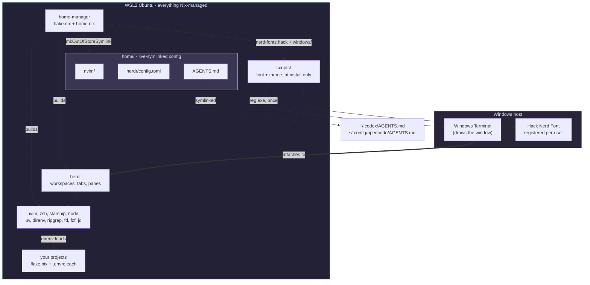

# dotfiles-wsl

A complete WSL2 Ubuntu development environment, declared in Nix and reproduced
on a new machine with one command.

Clone it onto a fresh Windows laptop, run `./bootstrap.sh`, and you get the same
packages, the same shell, the same editor, the same agent setup and the same
terminal look you had on the old one.

WSL Ubuntu is not NixOS, so there is no system-level Nix layer to hook into.
**Standalone home-manager** owns `$HOME` and nothing else. That turns out to be
the right amount: no `sudo`, no fight with `apt`, and nothing outside your home
directory to go wrong.

You get Nix-managed packages, zsh with autosuggestions and syntax highlighting,
Starship, a modular Neovim config, the herdr agent multiplexer, one global
`AGENTS.md` shared by every coding agent, Hack Nerd Font installed on the
Windows side straight from the Nix store, and a terminal colour scheme seeded on
first install.

---

## Contents

- [Design](#design)
- [Prerequisites](#prerequisites)
- [Install](#install)
- [Daily use](#daily-use)
- [Per-project toolchains](#per-project-toolchains)
- [Customizing](#customizing)
- [Repo layout](#repo-layout)
- [What is and is not reproducible](#what-is-and-is-not-reproducible)
- [Docs](#docs)

## Design

Three ideas carry the whole repo.

**Everything that can live in WSL, does.** Packages, shell, editor, multiplexer
and agent config are all Nix-managed and pinned by `flake.lock`. Wipe the
distro, clone, run `./bootstrap.sh`, and you are back exactly where you were.

**`$HOME` is global, projects are not.** This config installs the tools you
want on *every* machine. A project's Python version, its Node version and its
dependencies belong to that project, in its own `flake.nix`, loaded on `cd` by
direnv. That is what replaces nvm, pyenv and `pip install --user`. See
[Per-project toolchains](#per-project-toolchains).

**The terminal is a Windows process, so it gets seeded, not managed.** Windows
Terminal draws the window, and Nix cannot reach it. Two things cross the
boundary during install: the font, and a colour scheme. After that the terminal
is yours and no rebuild touches it. herdr provides the workspaces, tabs, panes
and detachable sessions, so the host terminal only has to be a fast, correct VT
renderer with a good font.



Config under `home/` is linked with `mkOutOfStoreSymlink`, so editing a file in
this repo takes effect immediately with no rebuild. You only rebuild when you
change which packages Nix manages.

## Prerequisites

- Windows 10 22H2 or Windows 11, with **Windows Terminal** (preinstalled on Win11)
- WSL2 with Ubuntu (`wsl --install -d Ubuntu`)
- `git` inside WSL (`sudo apt install -y git` - the only apt package you need)

Check you are on WSL**2**; WSL1 cannot run the Nix daemon:

```powershell
wsl -l -v      # VERSION column must say 2
```

## Install

```bash
git clone https://github.com/<you>/dotfiles-wsl.git ~/dotfiles-wsl
cd ~/dotfiles-wsl
./bootstrap.sh
```

That is the whole install. There is no second step on the Windows side.

| Step | What it does |
| --- | --- |
| 0 | Confirms you are in WSL |
| 1 | Ensures systemd is enabled, since the Nix daemon needs it |
| 2 | Installs [Determinate Nix](https://install.determinate.systems/) |
| 3 | Symlinks the repo to `~/.dotfiles`, the stable path configs refer to |
| 4 | Offers to rewrite the `user = ` line in `flake.nix` to your username |
| 5 | Runs the first `home-manager switch` (retries on transient WSL DNS) |
| 6 | Makes the Nix zsh your login shell |
| 7 | Installs Hack Nerd Font on the Windows side |
| 8 | Seeds the Windows Terminal colour scheme, once |

> If step 1 tells you to run `wsl --shutdown`, do that from **PowerShell**,
> reopen Ubuntu, and re-run `./bootstrap.sh`. Enabling systemd needs a restart.

The first build downloads a lot. That is normal and happens once.

Restart Windows Terminal afterwards. If glyphs still look wrong, sign out of
Windows and back in once so the newly registered font is enumerated.

## Daily use

```bash
./rebuild.sh       # apply any change to packages, shell or editor
```

Editing anything under `home/` (Neovim, herdr, `AGENTS.md`) needs **no rebuild**
- those are live symlinks. Rebuild when you change which packages Nix manages.

`rebuild.sh` deliberately does not touch Windows Terminal. See
[the terminal doc](docs/05-terminal.md) for why.

Start the multiplexer with `herdr`. Keybindings mirror tmux: `ctrl+b` prefix,
`prefix+c` new tab, `prefix+%` and `prefix+"` to split.

## Per-project toolchains

`home.nix` installs the tools that should exist everywhere: Node 24, uv, git,
ripgrep, Neovim. It does **not** install per-project versions. Those go in the
project:

```bash
cd ~/my-api
nix flake init -t ~/.dotfiles#python    # or #node
direnv allow
```

`cd` in and the project's Python, uv and ruff are on `PATH`. `cd` out and they
are gone. The versions are pinned by that project's own `flake.lock`, so they
travel with the repo rather than living on one laptop.

This is what replaces nvm, pyenv, conda and `pip install --user`. Full
explanation and the escape hatches in [docs/11-devshells.md](docs/11-devshells.md).

## Customizing

**Add a CLI tool.** Find it on [search.nixos.org](https://search.nixos.org/packages),
add it to `home.packages` in `home.nix`, run `./rebuild.sh`. If it is only
needed by one project, put it in that project's flake instead.

**Add a shell alias.** `programs.zsh.shellAliases` in `home.nix`, then rebuild.

**Change terminal colours, opacity or padding.** Windows Terminal's own Settings
UI. This repo seeds the scheme once at install and never writes that file again.
To re-seed after changing `windows/`, run
`./scripts/apply-windows-terminal-theme.sh --force`.

**Add a Neovim plugin.** Drop a file in `home/.config/nvim/lua/plugins/`.
lazy.nvim loads every file in that directory. No rebuild.

**Change agent behavior.** Edit `home/AGENTS.md`. It is symlinked into Claude
Code, Codex and opencode at once. No rebuild.

**Use a different terminal.** Nothing depends on Windows Terminal. Install what
you like; you need only Hack Nerd Font and truecolor. For a fully Nix-managed
terminal, add `wezterm` or `kitty` to `home.packages` and run it under WSLg -
100% reproducible, at the cost of WSLg latency and DPI quirks.
See [docs/05-terminal.md](docs/05-terminal.md).

## Repo layout

```
dotfiles-wsl/
├── flake.nix                       # inputs, pinning, the one `user =` line
├── home.nix                        # packages, zsh, starship, direnv, symlinks
├── modules/herdr.nix               # herdr from a hash-pinned upstream binary
├── bootstrap.sh                    # one-time setup, end to end
├── rebuild.sh                      # the everyday command
├── scripts/
│   ├── install-windows-font.sh     # font -> Windows, every rebuild
│   └── apply-windows-terminal-theme.sh   # theme -> Windows, install only
├── windows/                        # what gets seeded across the boundary
│   ├── blackpanther.json           # colour scheme
│   ├── profile-defaults.json       # font, opacity, padding, cursor
│   └── blackpanther.jpg            # background image
├── templates/                      # `nix flake init -t ~/.dotfiles#python`
│   ├── python/
│   └── node/
├── home/                           # live-symlinked into $HOME
│   ├── AGENTS.md                   # global agent memory, shared by all agents
│   └── .config/
│       ├── herdr/config.toml
│       └── nvim/
│           ├── init.lua
│           └── lua/
│               ├── vim_config.lua  # options + the WSL clipboard bridge
│               ├── plugin.lua      # lazy.nvim bootstrap
│               ├── keys.lua
│               └── plugins/        # one file per concern
└── docs/                           # line-by-line explanation of every file
```

## What is and is not reproducible

Worth being precise about, since that is the entire point of the repo.

**Fully reproducible**, declared in Nix and pinned by `flake.lock`: every CLI
package, Node, uv, direnv, Neovim, zsh and its plugins, Starship, herdr, the
Hack Nerd Font files, and every symlink into `$HOME`.

**Reproducible per project**, pinned by that project's own `flake.lock`:
language runtimes and project tooling, loaded by direnv on `cd`.

**Seeded once at install, then yours**: the Windows Terminal colour scheme,
font face, opacity and background image. Driven from committed files in
`windows/`, so a new machine gets your look automatically - but `settings.json`
is a file Windows Terminal itself writes, so after the first install this repo
never touches it again. Nothing reverts a change you make in the Settings UI.

**Not managed at all**: Windows Terminal itself (ships with Windows) and Windows
desktop settings. An earlier version of this repo shipped a `settings.ps1` of
registry writes; it was removed as overclaiming.

**Deliberately not pinned**: Neovim plugins, managed by lazy.nvim. Commit
`home/.config/nvim/lazy-lock.json` if you want them locked. Self-updating agent
CLIs (Claude Code, Codex) are likewise left to manage themselves in
`~/.local/bin`; see [docs/08-agents.md](docs/08-agents.md).

## Docs

| Doc | Covers |
| --- | --- |
| [00 - Architecture](docs/00-architecture.md) | Why the repo is shaped this way: no system layer, and the Windows boundary |
| [01 - flake.nix](docs/01-flake-nix.md) | Inputs, pinning, `homeConfigurations`, templates |
| [02 - home.nix](docs/02-home-nix.md) | Packages, zsh, Starship, direnv, `mkOutOfStoreSymlink` |
| [03 - modules/herdr.nix](docs/03-modules-herdr-nix.md) | Packaging a pinned binary in Nix |
| [04 - bootstrap.sh / rebuild.sh](docs/04-bootstrap-and-rebuild.md) | Both scripts, step by step |
| [05 - The terminal](docs/05-terminal.md) | Seeding the theme, and why it is seeded rather than managed |
| [06 - Neovim](docs/06-neovim.md) | Every Lua file, including the clipboard bridge |
| [07 - herdr](docs/07-herdr.md) | Keybindings and running agents in panes |
| [08 - Agents](docs/08-agents.md) | `AGENTS.md` fan-out, and what this repo refuses to manage |
| [09 - The Windows bridge](docs/09-windows-bridge.md) | The two scripts that cross to Windows |
| [10 - Troubleshooting](docs/10-troubleshooting.md) | WSL-specific failure modes |
| [11 - Devshells](docs/11-devshells.md) | Per-project toolchains with flakes and direnv |

## Credit

Derived from a macOS nix-darwin configuration by
[kunchenguid](https://github.com/kunchenguid/dotfiles). Unaffiliated port.

## License

MIT-0.
