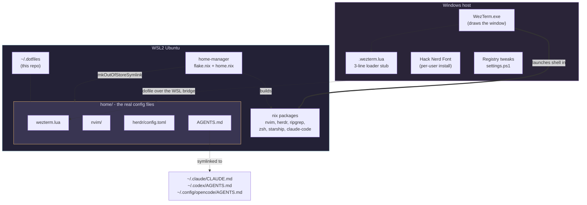

# dotfiles-wsl

A WSL2 Ubuntu port of the "freshly installed Mac to a full agentic engineering
setup" configuration from [this video](https://www.youtube.com/watch?v=5N-okeDdIuI)
([original macOS repo](https://github.com/kunchenguid/dotfiles)).

The video builds its setup on **nix-darwin**, which only exists for macOS. This
repo rebuilds the same environment on Windows + WSL2 Ubuntu using **standalone
home-manager**, plus two small PowerShell scripts for the parts that genuinely
have to live on Windows.

You end up with the same thing the video produces: Nix-managed packages, zsh
with autosuggestions and syntax highlighting, Starship, WezTerm on rose-pine
moon with Hack Nerd Font, a modular Neovim config, the herdr agent multiplexer,
and one global `AGENTS.md` shared by every coding agent.

---

## Contents

- [How this differs from the video](#how-this-differs-from-the-video)
- [Architecture](#architecture)
- [Prerequisites](#prerequisites)
- [Install](#install)
- [Daily use](#daily-use)
- [Customizing](#customizing)
- [Repo layout](#repo-layout)
- [What is and is not reproducible](#what-is-and-is-not-reproducible)
- [Uninstalling](#uninstalling)
- [Docs](#docs)

---

## How this differs from the video

| Video (macOS) | Here (WSL Ubuntu) | Why |
| --- | --- | --- |
| `nix-darwin` | standalone `home-manager` | WSL Ubuntu is not NixOS, so there is no system-level Nix module. home-manager owns `$HOME` only. |
| `sudo darwin-rebuild switch` | `home-manager switch` (no sudo) | Nothing outside `$HOME` is touched. |
| `nix-homebrew` + `brews`/`casks` | `home.packages` from nixpkgs | No Homebrew on Linux, and no need for it. |
| `system.defaults` (dock, Finder, key repeat) | `windows/settings.ps1` | Windows has no declarative settings API. These become registry writes. |
| WezTerm as a Homebrew cask | WezTerm installed on **Windows** via winget | WezTerm draws the window, so it is a Windows process, not a Linux one. |
| `macos_window_background_blur` | `win32_system_backdrop = "Acrylic"` | Different platform, same frosted-glass effect. |
| `nerd-fonts.hack` via Nix is enough | Also installed on Windows | The Windows font renderer cannot see Linux fontconfig. |
| `clipboard = 'unnamedplus'` just works | Bridged through `clip.exe` / `powershell.exe` | A WSL VM has no selection wired to the Windows clipboard. |
| `herdr` from Homebrew | Pinned upstream binary packaged in `modules/herdr.nix` | herdr is not in nixpkgs; we pin it by hash instead of `curl \| sh`. |
| zsh is already the login shell | `bootstrap.sh` runs `chsh` | Ubuntu logs you into bash. |

Full detail: [`docs/00-what-changed-from-macos.md`](docs/00-what-changed-from-macos.md).

## Architecture

The single most important idea: **the config files live in WSL, and Windows
reaches into WSL to read them.** Nothing is copied or duplicated, so there is
exactly one source of truth and no drift.



Because `home.nix` links config directories with `mkOutOfStoreSymlink`, editing
a file in this repo takes effect immediately, with no rebuild. And because the
WezTerm stub `dofile`s the config over `\\wsl.localhost`, hot reload still works
when you edit `wezterm.lua` from inside WSL.

## Prerequisites

- Windows 10 22H2 or Windows 11
- WSL2 with an Ubuntu distro installed (`wsl --install -d Ubuntu`)
- `git` inside WSL (`sudo apt install -y git` is fine; this is the only apt package you need)
- A GitHub SSH key if you plan to push changes

Check WSL is version 2, since WSL1 cannot run the Nix daemon:

```powershell
wsl -l -v      # VERSION column must say 2
```

## Install

### 1. WSL side

Inside your Ubuntu shell:

```bash
git clone https://github.com/<you>/dotfiles-wsl.git ~/dotfiles-wsl
cd ~/dotfiles-wsl
./bootstrap.sh
```

`bootstrap.sh` is idempotent and walks through seven steps:

| Step | What it does |
| --- | --- |
| 0 | Confirms you are in WSL |
| 1 | Ensures systemd is enabled, since the Nix daemon needs it |
| 2 | Installs [Determinate Nix](https://install.determinate.systems/) |
| 3 | Symlinks the repo to `~/.dotfiles`, the stable path every config refers to |
| 4 | Offers to rewrite the `user = ` line in `flake.nix` to your username |
| 5 | Runs the first `home-manager switch` |
| 6 | Makes the Nix zsh your login shell |
| 7 | Prints the Windows-side instructions |

> If step 1 tells you to run `wsl --shutdown`, do that from **PowerShell**, reopen
> Ubuntu, and re-run `./bootstrap.sh`. Enabling systemd requires a distro restart.

The first build downloads a lot and can take several minutes. That is normal and
only happens once.

### 2. Windows side

Open **PowerShell** (no admin needed) and navigate to the repo through the WSL
filesystem bridge:

```powershell
cd \\wsl.localhost\Ubuntu\home\<your-wsl-user>\dotfiles-wsl\windows
powershell -ExecutionPolicy Bypass -File .\setup-windows.ps1
```

That installs WezTerm via winget, installs Hack Nerd Font for your user, and
writes the loader stub to `%USERPROFILE%\.wezterm.lua`.

Optionally apply the Windows appearance settings, the counterpart of the video's
`system.defaults` block:

```powershell
powershell -ExecutionPolicy Bypass -File .\settings.ps1 -WhatIf   # preview
powershell -ExecutionPolicy Bypass -File .\settings.ps1           # apply
```

`settings.ps1` restarts Explorer at the end, so your taskbar will blink.

### 3. Launch

Open WezTerm from the Start menu. It should open directly into WSL, in your Linux
home directory, with a Starship prompt and a translucent Acrylic background.

Verify:

```bash
nvim --version | head -1
herdr --version
which zsh          # should be under ~/.nix-profile or /nix/store
```

## Daily use

```bash
./rebuild.sh       # apply any change to flake.nix / home.nix
```

That is the whole loop. `rebuild.sh` is the counterpart of the video's script,
minus the `sudo`.

Editing anything under `home/` (Neovim, herdr, WezTerm, `AGENTS.md`) needs **no
rebuild at all** - those are live symlinks. You only rebuild when you change
which packages or programs Nix manages.

Start the multiplexer with `herdr`. The keybindings in
`home/.config/herdr/config.toml` deliberately mirror tmux, so `ctrl+b` is the
prefix, `prefix+c` opens a tab, `prefix+%` and `prefix+"` split panes.

## Customizing

**Add a CLI tool.** Find it on [search.nixos.org](https://search.nixos.org/packages),
add it to `home.packages` in `home.nix`, run `./rebuild.sh`.

**Add a shell alias.** Add it to `programs.zsh.shellAliases` in `home.nix`,
then `./rebuild.sh`.

**Change the font size or colors.** Edit
`home/.config/wezterm/wezterm.lua` and save. WezTerm hot-reloads; no rebuild.

**Change your distro name.** If `wsl -l -q` does not say `Ubuntu-26.04`, update
`WSL_DISTRO` at the top of `home/.config/wezterm/wezterm.lua`.

**Add a Neovim plugin.** Drop a new file in
`home/.config/nvim/lua/plugins/`. lazy.nvim picks up every file in that
directory automatically.

**Change agent behavior.** Edit `home/AGENTS.md`. It is symlinked into Claude
Code, Codex, and opencode at once, so all three pick it up immediately.

**Pin a newer herdr.** Bump `version` in `modules/herdr.nix` and refresh the
hashes as documented in that file's header.

## Repo layout

```
dotfiles-wsl/
├── flake.nix                  # inputs, pinned versions, the one `user =` line
├── home.nix                   # packages, zsh, starship, all the symlinks
├── modules/herdr.nix          # herdr packaged from a pinned upstream binary
├── bootstrap.sh               # one-time WSL setup
├── rebuild.sh                 # the everyday command
├── windows/
│   ├── setup-windows.ps1      # WezTerm + font + loader stub
│   └── settings.ps1           # registry equivalent of system.defaults
├── home/                      # live-symlinked into $HOME
│   ├── AGENTS.md              # global agent memory, shared by all agents
│   ├── .claude/settings.json  # theme + status line
│   └── .config/
│       ├── wezterm/wezterm.lua
│       ├── herdr/config.toml
│       └── nvim/
│           ├── init.lua
│           └── lua/
│               ├── vim_config.lua   # options + the WSL clipboard bridge
│               ├── plugin.lua       # lazy.nvim bootstrap
│               ├── keys.lua         # personal keybinds
│               └── plugins/         # one file per concern
└── docs/                      # line-by-line explanation of every file
```

## What is and is not reproducible

Worth being precise about, since reproducibility is the whole premise of the
video.

**Fully reproducible** (declared in Nix, pinned by `flake.lock`): every CLI
package, Neovim itself, zsh and its plugins, Starship, herdr, and every symlink
into `$HOME`. Wipe the distro, clone, run `bootstrap.sh`, and you are back.

**Reproducible but imperative**: WezTerm and the Windows font. `setup-windows.ps1`
is idempotent and re-runnable, but winget resolves its own versions, so it is
not hash-pinned the way Nix is.

**Not reproducible in the Nix sense**: the Windows registry settings. Nothing
reverts a change you make by hand in the Settings app. Re-running `settings.ps1`
reasserts the values, and that is the strongest claim available on Windows.

**Deliberately not pinned**: Neovim plugins are managed by lazy.nvim, exactly as
in the video. Commit `home/.config/nvim/lazy-lock.json` after any plugin change
if you want them locked too.

## Uninstalling

```bash
# remove the home-manager generation
nix run home-manager/release-26.05 -- uninstall
# remove Nix itself (Determinate ships an uninstaller)
/nix/nix-installer uninstall
```

On Windows: uninstall WezTerm via `winget uninstall wez.wezterm`, delete
`%USERPROFILE%\.wezterm.lua`, and revert anything `settings.ps1` changed through
the Settings app.

## Docs

Every file in this repo is explained line by line in [`docs/`](docs/):

| Doc | Covers |
| --- | --- |
| [00-what-changed-from-macos.md](docs/00-what-changed-from-macos.md) | The full macOS to WSL mapping, and why each choice was made |
| [01-flake-nix.md](docs/01-flake-nix.md) | `flake.nix` |
| [02-home-nix.md](docs/02-home-nix.md) | `home.nix` |
| [03-modules-herdr-nix.md](docs/03-modules-herdr-nix.md) | `modules/herdr.nix` |
| [04-bootstrap-and-rebuild.md](docs/04-bootstrap-and-rebuild.md) | `bootstrap.sh`, `rebuild.sh` |
| [05-wezterm.md](docs/05-wezterm.md) | `wezterm.lua` and the Windows/WSL config bridge |
| [06-neovim.md](docs/06-neovim.md) | Every Neovim file, including the clipboard bridge |
| [07-herdr.md](docs/07-herdr.md) | `config.toml` and using herdr with agents |
| [08-agents.md](docs/08-agents.md) | `AGENTS.md` and `.claude/settings.json` |
| [09-windows-scripts.md](docs/09-windows-scripts.md) | Both PowerShell scripts |
| [10-troubleshooting.md](docs/10-troubleshooting.md) | WSL-specific failure modes |

## Credit

Original macOS configuration and the video that explains it:
[kunchenguid/dotfiles](https://github.com/kunchenguid/dotfiles).
This repo is an unaffiliated port.

## License

MIT-0.
