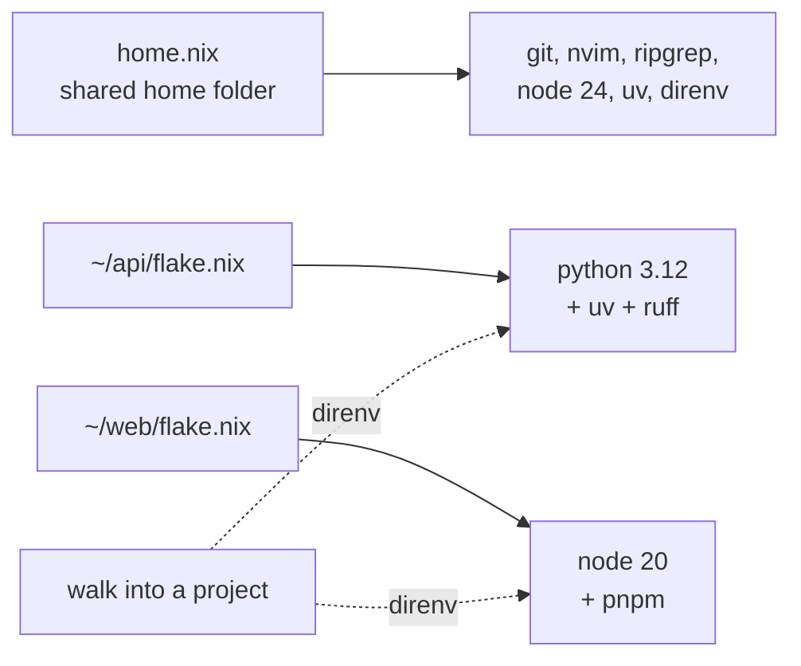

# 11 - Tools per project

Keeping a project's Python version inside the project, instead of on the laptop.

## The problem

`home.nix` rebuilds your home folder perfectly. It says nothing about your
projects, and that gap is where things go wrong:

- Node comes from nvm, so a new computer has no Node until you remember to
  install nvm and then the right version.
- Ubuntu's `python3` has no `pip`, so you add one with
  `--break-system-packages`. Now every project shares one folder full of
  packages, and you cannot tell which project needs which.
- Two projects want different Python versions, and something has to choose.

None of that is written down anywhere, and none of it is in git. A project
should carry its own tools, the same way it carries its own lock file.

## How it looks



`home.nix` gives you tools you want everywhere. Each project's `flake.nix` gives
you the versions that project needs, written down in its own `flake.lock` and
saved next to the code.

## Setting up a project

```bash
cd ~/my-api
nix flake init -t ~/.dotfiles#python     # or #node
direnv allow
```

`nix flake init -t` copies a starting point out of `templates/` in this repo: a
`flake.nix` and a one-line `.envrc`.

`direnv allow` gives permission for this one folder. direnv refuses to run an
`.envrc` file until you say yes, and it asks again whenever the file changes.

After that:

```
$ cd ~/my-api
direnv: loading ~/my-api/.envrc
direnv: using flake
$ python --version
Python 3.12.13

$ cd ..
direnv: unloading
$ python --version
Python 3.14.4          # Ubuntu's own Python again
```

Commit `flake.nix`, `flake.lock` and `.envrc`. Anyone who clones the project and
has Nix gets exactly the same tools.

## Why nix-direnv and not plain direnv

`home.nix` turns on both:

```nix
programs.direnv = {
  enable = true;
  nix-direnv.enable = true;
};
```

Plain direnv would rebuild the whole flake every single time you walk into the
folder, which takes seconds and gets annoying fast. It also does not tell Nix
that these tools are in use, so `nix-collect-garbage` deletes them and the next
visit downloads everything again.

nix-direnv remembers the result and marks it as in use, inside `.direnv/`. The
first visit is slow, every visit after that is instant, and cleaning up never
removes it.

Add `.direnv/` to the project's `.gitignore`.

## Which tool locks what

The templates do **not** try to describe every Python or npm package in Nix.
The split is:

| Layer | Locked by | Covers |
| --- | --- | --- |
| Language, compiler, system libraries | `flake.lock` | python3.12, node 24, openssl, postgres client |
| Language packages | `uv.lock`, `pnpm-lock.yaml` | requests, fastapi, react |

So the Python template points `uv` at the Nix-installed Python and lets it build
a normal `.venv` folder:

```nix
shellHook = ''
  export UV_PYTHON="${pkgs.python312}/bin/python3.12"
  export UV_PYTHON_DOWNLOADS=never
'';
```

`UV_PYTHON_DOWNLOADS=never` matters. Without it, uv quietly downloads its own
Python and the version you picked in Nix stops meaning anything.

You *can* describe every Python package in Nix, using tools like `poetry2nix` or
`uv2nix`. It is a much bigger job, and it buys little here, because the parts
that actually break between computers are the language and the system libraries,
and those are already locked.

## Adding a package to a project

Find it on [search.nixos.org](https://search.nixos.org/packages), add it to
`packages`, and save. direnv reloads at your next prompt.

```nix
packages = with pkgs; [
  python312
  uv
  ruff
  postgresql_16   # just the client tools, for psql
  ffmpeg
];
```

## Updating a project's versions

```bash
nix flake update          # move to the newest nixpkgs on that branch
nix flake update nixpkgs  # update one input only
```

This changes that project and nothing else. Your dotfiles versions are separate
and only move when you run `nix flake update` inside `~/.dotfiles`. That
separation is the point: adding a tool to `home.nix` must never change a
project's Python version.

## When this is the wrong tool

**Ready-made programs that expect a normal Linux layout.** Anything looking for
`/usr/lib`, or a loader at `/lib64/ld-linux-x86-64.so.2`, will fail inside a Nix
shell. Wrap it with `pkgs.buildFHSEnv`, or install it with `apt` and accept that
it sits outside the repeatable part.

**CUDA and graphics card work.** Possible, but the driver half lives outside Nix
and the CUDA packages are huge. A container is usually less trouble.

**Quick experiments.** You do not need a flake to try one tool:

```bash
nix shell nixpkgs#httpie      # available until you close the shell
nix run nixpkgs#cowsay -- hi  # run once, install nothing
```

## Moving off the old tools

- **nvm**: Node 24 is in `home.nix` now. If a project needs a different major
  version, put `nodejs_20` in its flake. You can delete `~/.nvm` once nothing
  uses it.
- **`pip --user`**: anything in `~/.local/bin` starting with `#!/usr/bin/python3`
  is a shared install. Move it into the project that needs it, or install it on
  its own with `uv tool install`.
- **conda and pyenv**: replaced by putting `python3xx` in each project's flake.

There is no rush. The old tools keep working. The difference is that only the
flake ones survive a new laptop.
