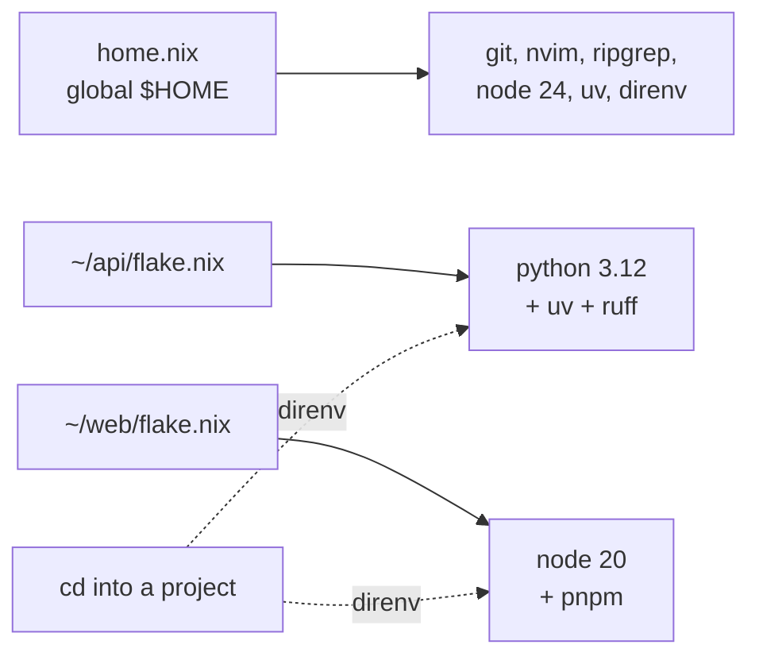

# 11 - Devshells

Per-project toolchains, so a project's Python version lives in the project
instead of on the laptop.

## The problem this solves

`home.nix` reproduces `$HOME` perfectly. It says nothing about your projects,
and that gap is where environments rot:

- Node comes from nvm, so a new machine has no Node until you remember to
  install nvm and then the right version.
- Ubuntu's `python3` has no `pip`, so you bootstrap one with
  `--break-system-packages`, and now every project shares one mutable
  `~/.local` full of packages you cannot attribute to anything.
- Two projects want different Python versions and a version manager has to
  arbitrate.

None of that is reproducible, and none of it is in git. A project should carry
its own toolchain the same way it carries its own lockfile.

## The shape



`home.nix` gives you the tools you want everywhere. Each project's `flake.nix`
gives you the versions that project needs, pinned in its own `flake.lock` and
committed alongside the code.

## Setting up a project

```bash
cd ~/my-api
nix flake init -t ~/.dotfiles#python     # or #node
direnv allow
```

`nix flake init -t` copies a starting point out of `templates/` in this repo:
a `flake.nix` and a one-line `.envrc`. `direnv allow` is a per-directory trust
prompt - direnv refuses to run an `.envrc` until you approve it, and re-asks
whenever the file changes.

From then on:

```
$ cd ~/my-api
direnv: loading ~/my-api/.envrc
direnv: using flake
$ python --version
Python 3.12.13

$ cd ..
direnv: unloading
$ python --version
Python 3.14.4           # back to Ubuntu's
```

Commit `flake.nix`, `flake.lock` and `.envrc`. Anyone who clones the repo and
has Nix gets the identical toolchain.

## Why nix-direnv and not plain direnv

`home.nix` enables both:

```nix
programs.direnv = {
  enable = true;
  nix-direnv.enable = true;
};
```

Plain direnv would re-evaluate the entire flake on every single `cd` into the
directory, which takes seconds and gets old fast. It also registers no GC root,
so `nix-collect-garbage` deletes your project toolchain and the next `cd`
re-downloads it.

nix-direnv caches the evaluated environment and pins it with a GC root under
`.direnv/`. First entry is slow, every later one is instant, and garbage
collection leaves it alone.

Add `.direnv/` to the project's `.gitignore`.

## The Nix/language-package-manager split

The templates deliberately do **not** try to express every PyPI or npm
dependency in Nix. The split is:

| Layer | Pinned by | Covers |
| --- | --- | --- |
| Interpreter, compiler, system libs | `flake.lock` | python3.12, node 24, openssl, postgres client |
| Language packages | `uv.lock`, `pnpm-lock.yaml` | requests, fastapi, react |

So the Python template sets `UV_PYTHON` to the Nix-pinned interpreter and lets
uv build a normal `.venv`:

```nix
shellHook = ''
  export UV_PYTHON="${pkgs.python312}/bin/python3.12"
  export UV_PYTHON_DOWNLOADS=never
'';
```

`UV_PYTHON_DOWNLOADS=never` matters: without it uv silently downloads its own
CPython and the Nix pin becomes decorative.

Expressing PyPI in Nix is possible (`poetry2nix`, `uv2nix`) but it is a much
bigger commitment, and the payoff is small when the interpreter and system
libraries - the parts that actually break across machines - are already pinned.

## Adding a package to a project

Find it on [search.nixos.org](https://search.nixos.org/packages), add it to
`packages`, save. direnv reloads on the next prompt.

```nix
packages = with pkgs; [
  python312
  uv
  ruff
  postgresql_16   # just the client tools, for psql
  ffmpeg
];
```

## Updating a project's pins

```bash
nix flake update          # move to the latest nixpkgs for that branch
nix flake update nixpkgs  # just that one input
```

This changes only that project. Your dotfiles pins are separate and move only
when you run `nix flake update` in `~/.dotfiles`. That separation is the point:
a project's toolchain should not shift because you added a CLI tool to
`home.nix`.

## When a devshell is the wrong tool

**Prebuilt binaries that assume FHS.** Anything expecting `/usr/lib` or a
dynamic loader at `/lib64/ld-linux-x86-64.so.2` will fail in a Nix shell.
Wrap it in `pkgs.buildFHSEnv`, or install it with `apt` and accept that it is
outside the reproducible set.

**CUDA and GPU work.** Doable, but the driver half lives outside Nix and
`nixpkgs` CUDA packages are large. A container is often less trouble.

**Throwaway experiments.** You do not need a flake to try one tool:

```bash
nix shell nixpkgs#httpie      # in scope until you exit the shell
nix run nixpkgs#cowsay -- hi  # run once, install nothing
```

## Migrating off the old tools

- **nvm**: Node 24 is in `home.nix` now. For a project on a different major,
  put `nodejs_20` in its flake. `~/.nvm` can go once nothing references it.
- **`pip --user`**: anything in `~/.local/bin` backed by `#!/usr/bin/python3`
  is a global install. Move it into the project that needs it, or install it as
  an isolated tool with `uv tool install`.
- **conda / pyenv**: replaced entirely by a per-project `python3xx` in the flake.

There is no rush. The old tools keep working; the difference is that only the
flake-based ones survive a new laptop.
